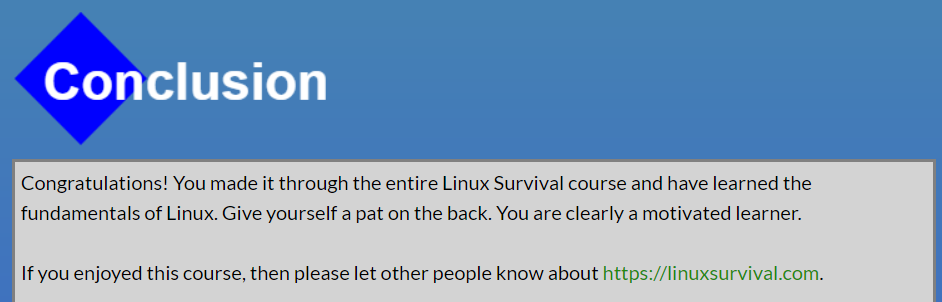
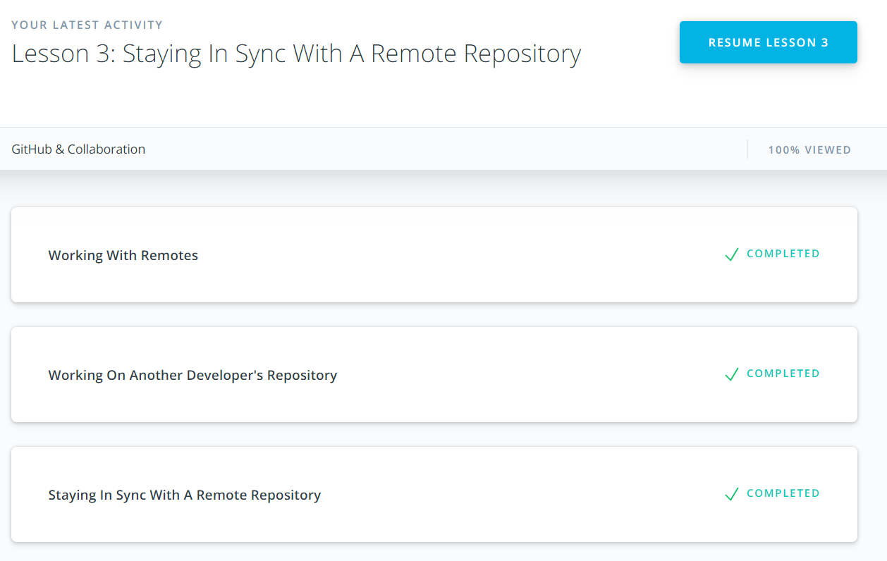

# kottans-backend

*Repo for studying at kottans-backend*

## [Unix Shell](https://github.com/kottans/backend/blob/master/tasks/unix-shell.md)
1. 

2. Never had to list hidden files in shell, but now I know that `ls -a` can do this;

## [Git Collaboration](https://github.com/kottans/backend/blob/master/tasks/git-collaboration.md)

what was new to you - some commands;
what surprised you - squash and rebase at the same time;
what you intend to use in future - squash commits instead of ammend

